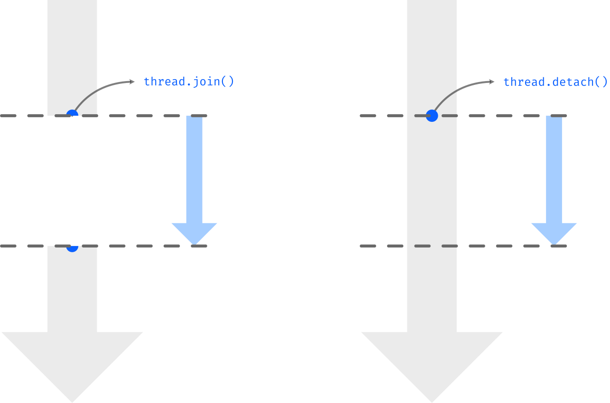

# Parallel Programming in C++

## Table of Contents
 - [Types of Parallelism](#types-of-parallelism)
 - [Join and Detach](#join-and-detach)

## Types of Parallelism

There are two kinds of parallelism:

### Task Parallelism

The main task is splitted into smaller ones which can be perform independently and simultaneously.

For example: to process a queue of independent elements by taking multiple items at the same time until emptying the queue.

### Data Parallelism

A big dataset can be splitted into smaller parts than can be processed independently and simultaneously.

For example: to process the product between two matrices by computing each element of the new matrix in different process units.

## Join and Detach

Every process has at least on thread called *main thread* which is the entry point for the program.

***Thread*** of execution is the smallest sequence of programmed instrunctions that can be managed independently by a scheduler.

